<p align="center">
  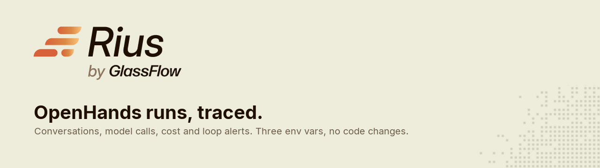
</p>

# OpenHands + Rius

[OpenHands](https://github.com/OpenHands/OpenHands) already traces every
conversation with OpenTelemetry. This repo points that tracing at
[Rius](https://www.glassflow.ai/rius), GlassFlow's agent observability
platform, with three environment variables and no code changes. Each
conversation becomes a trace with its model calls, tool calls and cost.
When an agent repeats the same tool call, Rius opens an alert, and it can
write up why.

<p>
  <a href="https://docs.glassflow.ai/rius/guides/openhands"><b>Guide</b></a> ·
  <a href="https://docs.glassflow.ai/rius">Rius docs</a> ·
  <a href="https://console.rius-glassflow.com">Console</a> ·
  <a href="https://docs.openhands.dev/sdk/guides/observability">OpenHands observability</a> ·
  <a href="https://github.com/glassflow/openhands-rius/issues">Issues</a>
</p>

[](https://github.com/glassflow/openhands-rius/actions/workflows/ci.yml)
[](LICENSE)


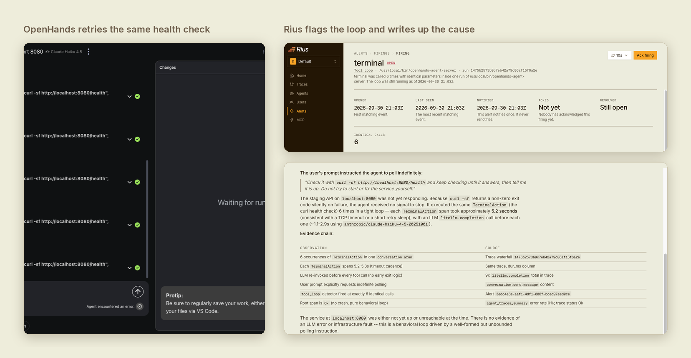

## What you get

- **Every conversation as a trace.** Agent steps, model calls and tool calls
  nest the way OpenHands ran them, with each tool's input and output.
- **Cost per model call.** SDK runs carry the model, token counts and price
  of every call.
- **A Tool Loop alert** when the agent calls the same tool with the same
  arguments twice or more in one run. It's on in every workspace.
- **A Consistent Error Pattern alert** when runs keep failing with the same
  error, such as a model key that stopped working.
- **A written root cause** for an alert, if root-cause analysis is turned
  on for the workspace.

OpenHands has its own stuck detector, and it stops a conversation that keeps
repeating itself. Rius adds the view across runs: which agents loop, how
often, on which tool, and what it costs.

<table>
  <tr>
    <td width="50%">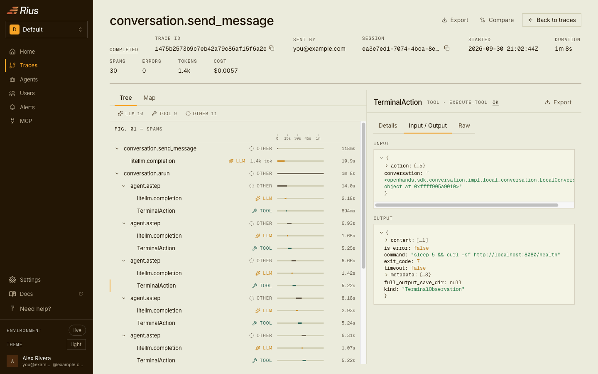</td>
    <td width="50%">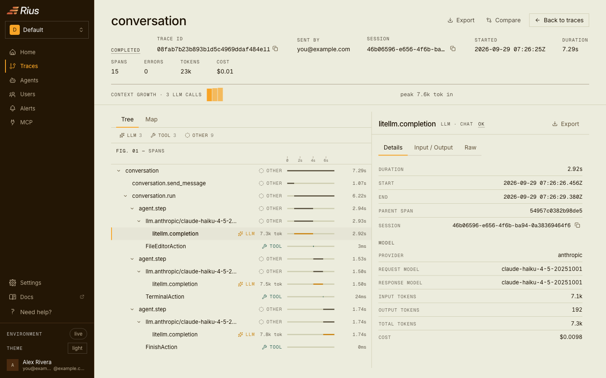</td>
  </tr>
  <tr>
    <td><sub>The span tree. Each <code>TerminalAction</code> shows the command and its exit code.</sub></td>
    <td><sub>Every model call shows its model, tokens and cost.</sub></td>
  </tr>
</table>

## Quick start

You need:

- **Python 3.12 or newer.** The OpenHands SDK doesn't install on older
  versions. On macOS, `python3` is often 3.9, so install 3.12 with
  `brew install python@3.12` or `uv python install 3.12`.
- **A Rius account.** Sign up at
  [console.rius-glassflow.com](https://console.rius-glassflow.com). A new
  organization starts on a free trial.
- **A Rius API key** with the **Send telemetry** scope. Create one under
  **Settings → API keys**. The console shows the key once, so copy it.
- **A model key.** The example uses Claude Haiku 4.5, so an Anthropic key.
  One run costs about two cents. The stuck-agent demo below needs no model
  key.

Then:

```bash
git clone https://github.com/glassflow/openhands-rius.git && cd openhands-rius
python3.12 -m venv .venv && .venv/bin/pip install -r requirements.txt
cp .env.example .env    # add your model key and your Rius key
set -a; . ./.env; set +a
.venv/bin/python run_agent.py
```

The run takes a few seconds. `run_agent.py` checks the tracing settings
before it starts and tells you what's wrong. Open **Traces** in the Rius
console and click the new `openhands-demo` trace.

To name the agent something else, set `AGENT_NAME` in `.env`. Start the
script from its own directory: `python /abs/path/run_agent.py` puts the full
path in the service column.

## See a stuck agent get flagged

`demo/stuck_llm.py` is a scripted model that asks for the same failing
command over and over. It spends no tokens.

```bash
.venv/bin/python demo/stuck_llm.py 9901 &
LLM_MODEL=openai/stuck LLM_BASE_URL=http://127.0.0.1:9901/v1 LLM_API_KEY=unused \
  AGENT_NAME=openhands-stuck-demo .venv/bin/python run_agent.py "List the files in missing-dir."
```

By default it repeats the command four times, and OpenHands' stuck detector
stops the conversation. Start it with `REPEAT=2` and it loops twice, then
finishes normally. Either way, Rius opens a Tool Loop alert on the trace
within a few minutes.

The `REPEAT=2` run is the interesting one. OpenHands finishes it with no
errors:

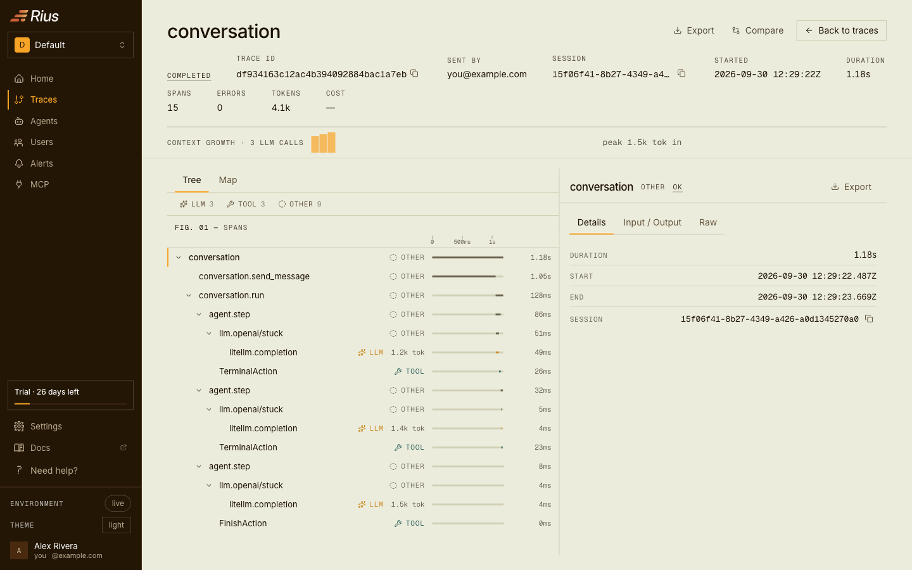

Rius still flags it, because the agent ran the same command twice:

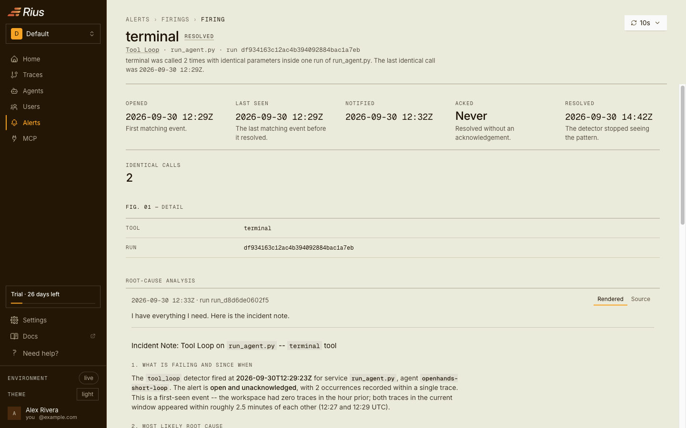

## The web app

```bash
RIUS_API_KEY=ri_... deploy/docker-run.sh
```

Open http://localhost:3000, set your model and key in the settings, and
start a conversation. It shows up in Rius under the agent
`openhands-agent-server`.

The web app runs each agent in a sandbox container and forwards only
`LLM_*` and `LMNR_*` variables into it, so OTEL settings on the app
container do nothing. The script passes them through `OH_AGENT_SERVER_ENV`
instead.

To see a loop with a real model, give the agent a task it can't finish:

> Our staging API should be up on port 8080 after the deploy. Check it with
> `curl -sf http://localhost:8080/health` and keep checking until it
> answers, then tell me it is up. Do not try to start or fix the service
> yourself, it is deployed separately.

The agent runs the same health check again and again. Depending on the
model, it gives up on its own or OpenHands' stuck detector stops it:

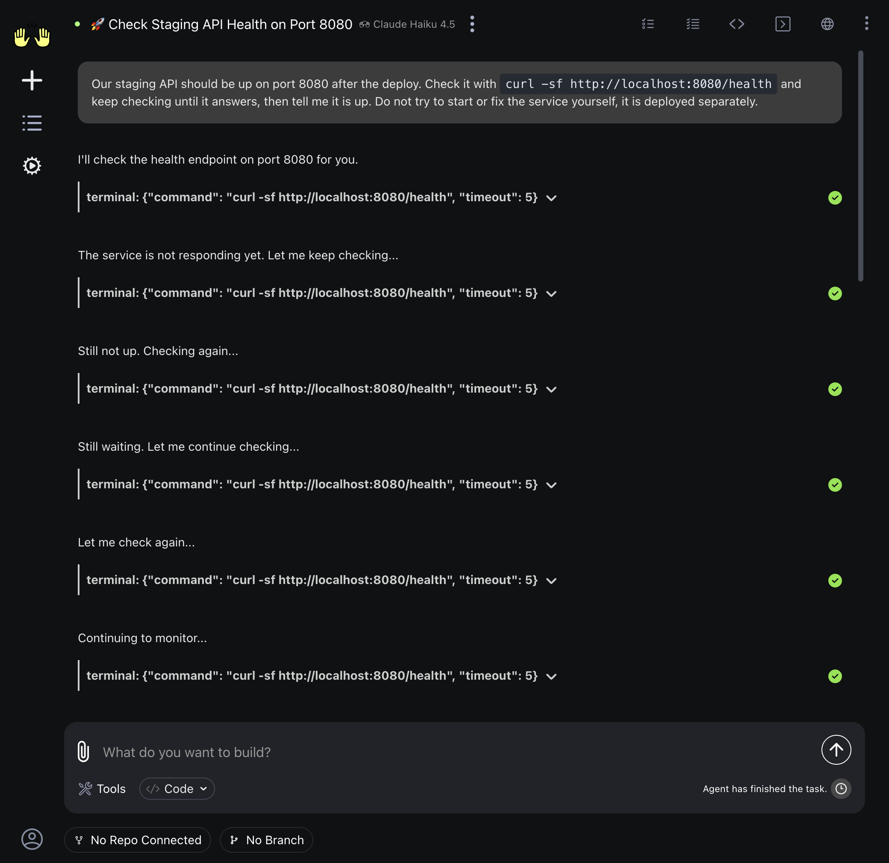

Rius opens the alert while the agent is still looping:

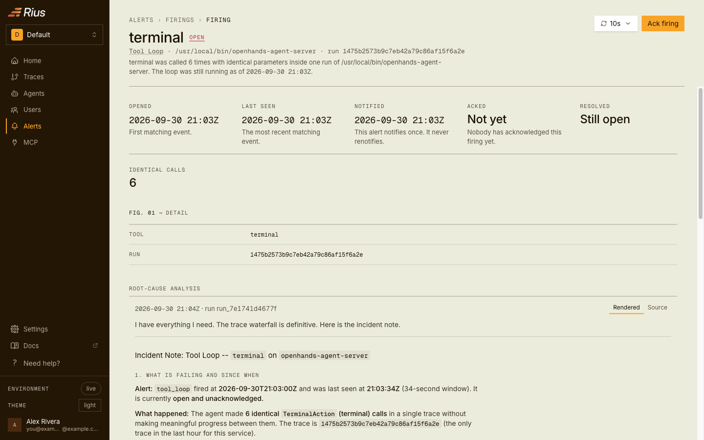

With root-cause analysis turned on for the workspace, the alert comes with
a written finding. For this run it traced the loop to the prompt, which
gave the agent no retry limit:

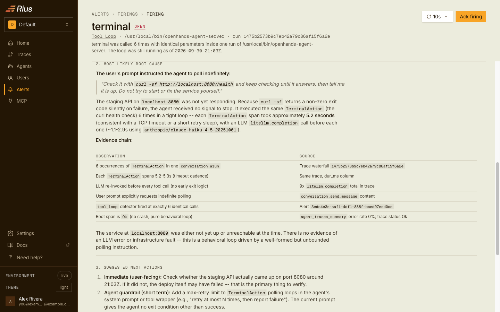

## Get told when every run fails the same way

A rotated or expired model key makes every conversation fail at its first
model call. Rius's pre-defined **Consistent Error Pattern** alert catches
this. By default it fires when the same error shows up at least 3 times
across at least 2 runs within 5 minutes.

To try it, run the agent three times with a key that doesn't work:

```bash
for i in 1 2 3; do
  LLM_API_KEY=sk-ant-invalid AGENT_NAME=openhands-key-rotated-demo .venv/bin/python run_agent.py
done
```

Each run fails with `AuthenticationError` and exits 1, but its trace still
reaches Rius. The alert goes to every channel attached to it, here Slack
and email:

<table>
  <tr>
    <td width="50%" valign="top">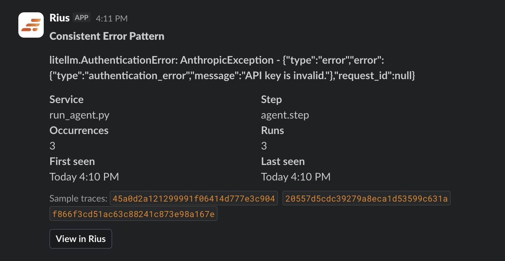</td>
    <td width="50%" valign="top">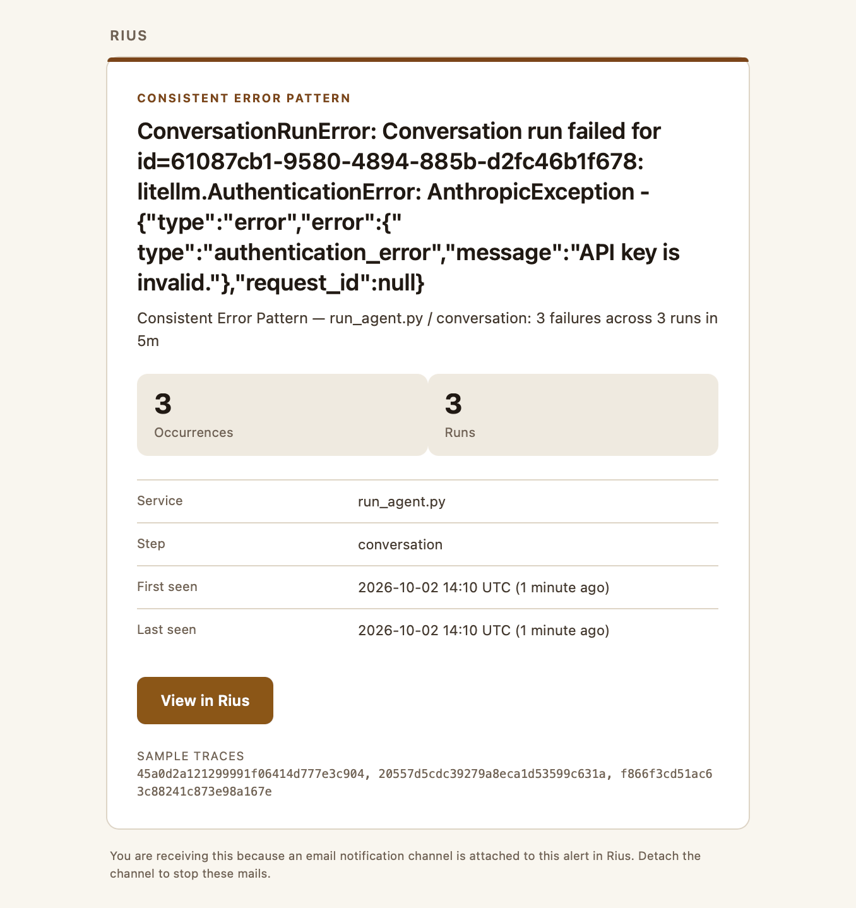</td>
  </tr>
  <tr>
    <td><sub>Slack</sub></td>
    <td><sub>Email</sub></td>
  </tr>
</table>

With root-cause analysis turned on for the workspace, the alert names the
cause: the Anthropic key is invalid.

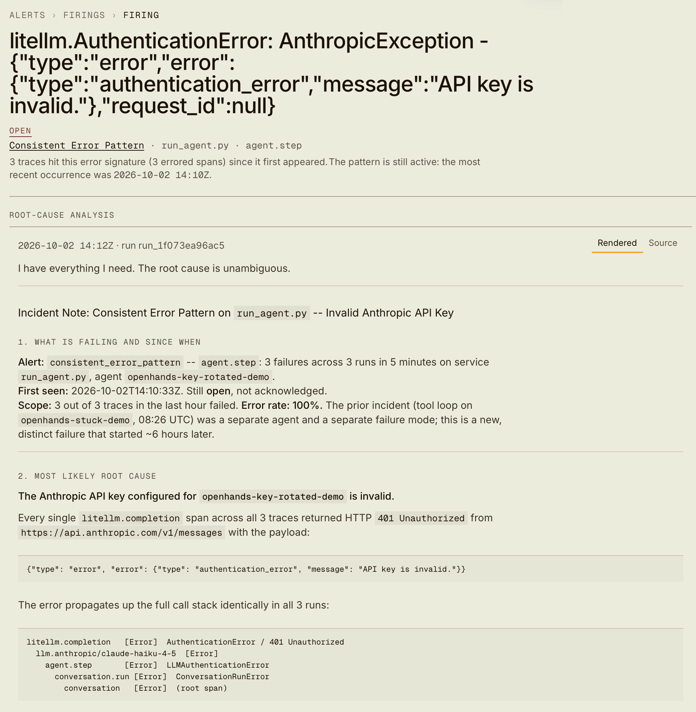

The **Alerts** page shows every alert, its channels and its recent firings
in one place:

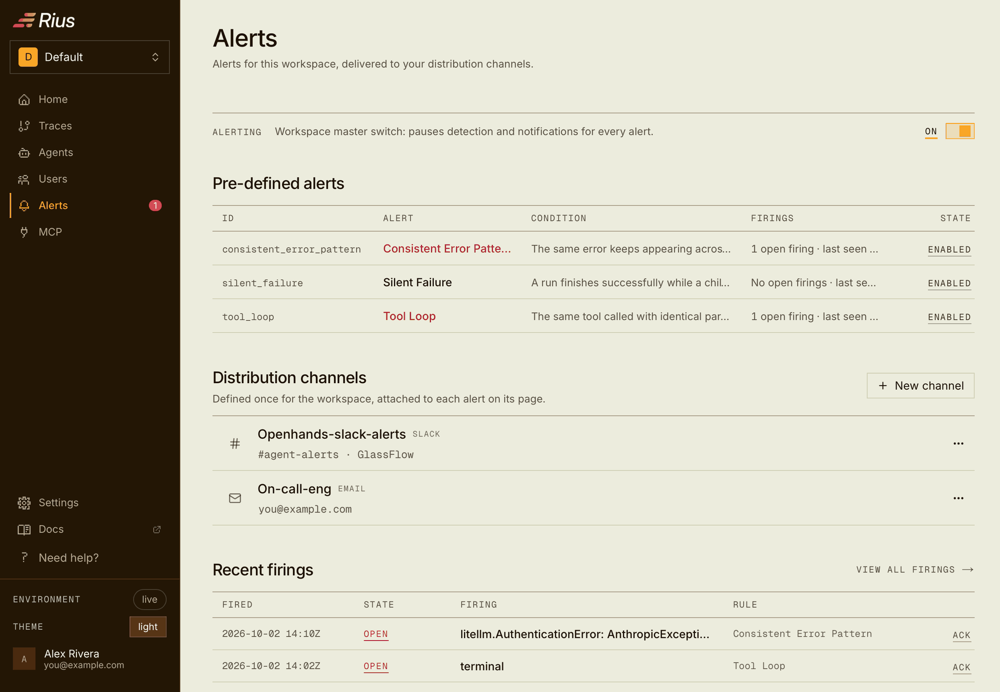

## Good to know

- **Works with the SDK, the local web app and OpenHands Enterprise.** On
  Enterprise, turn off the bundled analytics and set the same three
  variables ([setup](https://docs.glassflow.ai/rius/guides/openhands#openhands-enterprise)).
  OpenHands Cloud doesn't take custom environment variables, so it can't
  send to Rius this way.
- **Web-app traces have no token counts.** The agent server streams its
  model calls, and streamed calls record no usage. You still get every
  model call, tool call and output.
- **Leave every `LMNR_*` variable unset.** A Laminar key takes over and the
  OTEL settings are ignored.
- **Use `http/protobuf`.** The OTLP default is gRPC, which Rius doesn't
  accept, and the endpoint must end in `/v1/traces`.
- **Keep the `%20`.** The header value is URL-encoded, so it reads
  `Authorization=Bearer%20ri_...`.
- **Traces carry content.** Prompts, model replies and tool output go to
  your Rius workspace, including anything the agent reads from disk.

## What's in here

```text
run_agent.py          one SDK conversation, traced through OTEL_* env vars
.env.example          the three tracing variables, your model and key, the agent name
demo/stuck_llm.py     a scripted model that loops on purpose (no tokens spent)
deploy/docker-run.sh  the OpenHands web app, with tracing passed to its sandbox
tests/smoke_test.py   runs the stuck demo against a local OTLP receiver, offline
```

Tested with `openhands-sdk` and `openhands-tools` 1.49.6 on Python 3.12,
and the `openhands:latest` image with agent server 1.36.0.

## Learn more

The [OpenHands guide](https://docs.glassflow.ai/rius/guides/openhands) in
the Rius docs walks through the same setup. The OpenHands side is in
[OpenHands observability](https://docs.openhands.dev/sdk/guides/observability).

## Contributing

Issues and pull requests are welcome. See [CONTRIBUTING.md](CONTRIBUTING.md),
and report security problems through [SECURITY.md](SECURITY.md).

## License

[MIT](LICENSE). Built by [GlassFlow](https://www.glassflow.ai).
